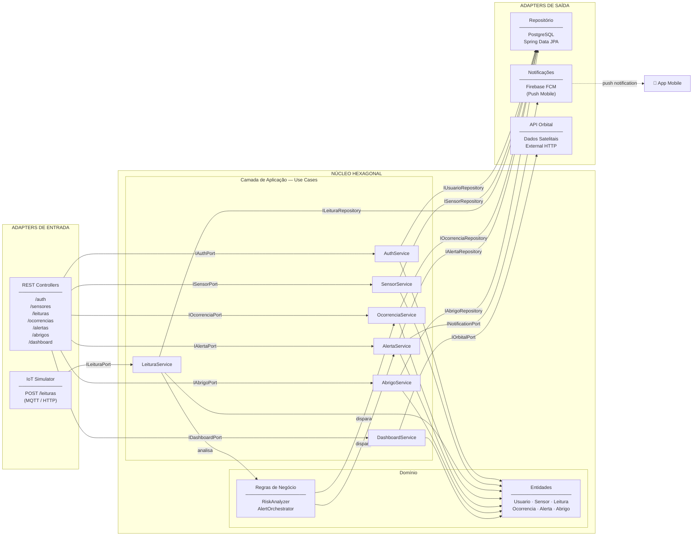

# OrbiGuard API — Arquitetura e Endpoints

## Visão Geral

O OrbiGuard é uma plataforma que conecta dados orbitais, sensores IoT e comunidades vulneráveis para transformar sinais climáticos em ações locais rápidas.

> O satélite vê o macro, o sensor confirma o micro, e o app transforma isso em ação.

A API funciona como o núcleo da solução, sendo responsável por:

- autenticação de usuários
- recebimento de dados IoT
- gerenciamento de ocorrências
- geração de alertas
- gerenciamento de abrigos
- comunicação com o aplicativo mobile

---

## Arquitetura Hexagonal

### Diagrama Geral



### Estrutura de Pacotes

```
orbi-guard-api/
├── domain/
│   ├── model/
│   │   ├── Usuario.java
│   │   ├── Sensor.java
│   │   ├── Leitura.java
│   │   ├── Ocorrencia.java
│   │   ├── Alerta.java
│   │   └── Abrigo.java
│   └── service/
│       ├── RiskAnalyzer.java          ← regra: leitura > limite → risco
│       └── AlertOrchestrator.java     ← regra: risco → cria ocorrência + alerta
│
├── application/
│   ├── port/
│   │   ├── in/                        ← Portas Primárias (interfaces)
│   │   │   ├── IAuthPort.java
│   │   │   ├── ISensorPort.java
│   │   │   ├── ILeituraPort.java
│   │   │   ├── IOcorrenciaPort.java
│   │   │   ├── IAlertaPort.java
│   │   │   ├── IAbrigoPort.java
│   │   │   └── IDashboardPort.java
│   │   └── out/                       ← Portas Secundárias (interfaces)
│   │       ├── IUsuarioRepository.java
│   │       ├── ISensorRepository.java
│   │       ├── ILeituraRepository.java
│   │       ├── IOcorrenciaRepository.java
│   │       ├── IAlertaRepository.java
│   │       ├── IAbrigoRepository.java
│   │       ├── INotificationPort.java
│   │       └── IOrbitalPort.java
│   └── usecase/
│       ├── AuthService.java
│       ├── SensorService.java
│       ├── LeituraService.java
│       ├── OcorrenciaService.java
│       ├── AlertaService.java
│       ├── AbrigoService.java
│       └── DashboardService.java
│
└── adapter/
    ├── in/
    │   └── rest/                      ← Adapters Primários
    │       ├── AuthController.java
    │       ├── SensorController.java
    │       ├── LeituraController.java
    │       ├── OcorrenciaController.java
    │       ├── AlertaController.java
    │       ├── AbrigoController.java
    │       └── DashboardController.java
    └── out/
        ├── persistence/               ← Adapter: banco de dados
        │   ├── UsuarioRepositoryImpl.java
        │   ├── SensorRepositoryImpl.java
        │   ├── LeituraRepositoryImpl.java
        │   ├── OcorrenciaRepositoryImpl.java
        │   ├── AlertaRepositoryImpl.java
        │   └── AbrigoRepositoryImpl.java
        ├── notification/              ← Adapter: Firebase FCM
        │   └── FirebaseNotificationAdapter.java
        └── orbital/                   ← Adapter: API de dados satelitais
            └── OrbitalApiAdapter.java
```

### Fluxo de uma Leitura Crítica

```
IoT Simulator
    │
    ▼
ILeituraPort (porta primária)
    │
    ▼
LeituraService (use case)
    │
    ├──► ILeituraRepository → PostgreSQL  (salva leitura)
    │
    └──► RiskAnalyzer (domínio)
              │  valor > limite?
              ▼
         AlertOrchestrator (domínio)
              │
              ├──► OcorrenciaService → IOcorrenciaRepository → PostgreSQL
              │
              └──► AlertaService
                        │
                        ├──► IAlertaRepository → PostgreSQL
                        │
                        └──► INotificationPort → Firebase FCM → 📱 App Mobile
```

### Princípios da Arquitetura

| Camada | Dependências permitidas | Responsabilidade |
|---|---|---|
| **Domain** | nenhuma | Entidades e regras puras de negócio |
| **Application** | Domain | Orquestração dos casos de uso |
| **Adapters** | Application (via interfaces) | I/O: HTTP, banco, notificações |

> A regra de ouro: **o domínio não conhece nada externo**. Toda dependência aponta para dentro.

---

## Estrutura da API

| Rota | Descrição |
|---|---|
| `/auth` | Autenticação e registro |
| `/usuarios` | Gerenciamento de usuários |
| `/sensores` | Dispositivos IoT |
| `/leituras` | Leituras dos sensores |
| `/ocorrencias` | Eventos críticos |
| `/alertas` | Notificações para o app |
| `/abrigos` | Locais de evacuação |
| `/voluntarios` | Gerenciamento de voluntários |
| `/dashboard` | Indicadores consolidados |

---

## Autenticação

### `POST /auth/login`

Login do usuário e geração do JWT.

**Request**
```json
{
  "email": "admin@orbigguard.com",
  "senha": "123456"
}
```

**Response**
```json
{
  "token": "jwt_token_aqui",
  "usuario": {
    "id": 1,
    "nome": "Yuri",
    "perfil": "ADMIN"
  }
}
```

### `POST /auth/register`

Cadastro de usuários e voluntários.

**Request**
```json
{
  "nome": "Maria Silva",
  "email": "maria@email.com",
  "senha": "123456",
  "perfil": "VOLUNTARIO"
}
```

---

## Sensores

Os sensores representam dispositivos IoT instalados em regiões vulneráveis.

**Tipos possíveis:** `NIVEL_AGUA` · `FUMACA` · `TEMPERATURA` · `QUALIDADE_AR` · `UMIDADE`

### `GET /sensores`

Lista todos os sensores cadastrados.

**Response**
```json
[
  {
    "id": 1,
    "tipo": "NIVEL_AGUA",
    "status": "ATIVO",
    "localizacao": "Vila Esperança"
  }
]
```

### `GET /sensores/{id}`

Busca detalhes de um sensor específico.

### `POST /sensores`

Cadastra um novo sensor.

**Request**
```json
{
  "tipo": "NIVEL_AGUA",
  "localizacao": "Vila Esperança - SP",
  "latitude": -23.5505,
  "longitude": -46.6333
}
```

### `DELETE /sensores/{id}`

Remove ou desativa um sensor.

---

## Leituras dos Sensores

As leituras são enviadas pelo simulador IoT.

### `POST /leituras`

Recebe leituras enviadas pelos sensores.

**Request**
```json
{
  "sensorId": 1,
  "valor": 87.5,
  "unidade": "%",
  "dataHora": "2026-05-28T14:30:00"
}
```

#### Regras automáticas

A API interpreta os dados recebidos e age automaticamente:

| Condição | Ação |
|---|---|
| Nível da água > 80% | Risco crítico |
| Fumaça detectada | Alerta de incêndio |
| Temperatura extrema | Estado de atenção |

Quando uma regra é disparada:

1. Uma ocorrência é criada
2. Um alerta é gerado
3. O app mobile é atualizado

### `GET /sensores/{id}/leituras`

Lista histórico de leituras de um sensor.

---

## Ocorrências

As ocorrências representam eventos críticos detectados pela plataforma.

**Exemplos:** `ALAGAMENTO` · `INCENDIO` · `DESLIZAMENTO` · `CALOR_EXTREMO`

### `POST /ocorrencias`

Cria uma ocorrência manual ou automática.

**Request**
```json
{
  "tipo": "ALAGAMENTO",
  "gravidade": "CRITICA",
  "localizacao": "Rua das Flores, 120",
  "latitude": -23.551,
  "longitude": -46.632,
  "descricao": "Nível da água acima do limite seguro."
}
```

### `GET /ocorrencias`

Lista ocorrências.

### `GET /ocorrencias/{id}`

Detalha uma ocorrência.

### `PUT /ocorrencias/{id}`

Atualiza status da ocorrência.

**Request**
```json
{
  "status": "EM_ATENDIMENTO"
}
```

**Status possíveis:** `ABERTA` · `EM_ATENDIMENTO` · `RESOLVIDA` · `CANCELADA`

---

## Alertas

Os alertas são enviados para o aplicativo mobile.

### `GET /alertas`

Lista alertas ativos.

**Response**
```json
[
  {
    "id": 1,
    "mensagem": "Risco crítico de alagamento.",
    "nivel": "CRITICO"
  }
]
```

### `POST /alertas`

Cria um alerta vinculado a uma ocorrência.

**Request**
```json
{
  "ocorrenciaId": 10,
  "mensagem": "Risco crítico de alagamento na região.",
  "nivel": "CRITICO"
}
```

### `GET /alertas/ativos`

Retorna apenas alertas ativos para o dashboard.

---

## Abrigos

Os abrigos representam locais seguros para evacuação.

### `GET /abrigos`

Lista todos os abrigos.

### `GET /abrigos/disponiveis`

Retorna apenas abrigos com vagas disponíveis.

### `POST /abrigos`

Cadastra um novo abrigo.

**Request**
```json
{
  "nome": "Escola Municipal Esperança",
  "capacidade": 200,
  "ocupacaoAtual": 45,
  "latitude": -23.552,
  "longitude": -46.635
}
```

### `PUT /abrigos/{id}/ocupacao`

Atualiza ocupação do abrigo.

**Request**
```json
{
  "ocupacaoAtual": 80
}
```

---

## Dashboard Inteligente

### `GET /dashboard/risco`

Alimenta o painel principal do aplicativo com os principais indicadores da plataforma.

**Response**
```json
{
  "nivelRisco": "CRITICO",
  "alertasAtivos": 3,
  "ocorrenciasAbertas": 5,
  "abrigosDisponiveis": 2,
  "sensoresCriticos": 4
}
```

---

## Fluxo Principal do Sistema

```
1. Sensor envia leitura → POST /leituras
2. API analisa os dados recebidos
3. Valor acima do limite?
   ├── Ocorrência criada automaticamente
   └── Alerta gerado e enviado ao app
4. Usuário recebe notificação no mobile
5. App exibe:
   ├── Nível de risco atual
   ├── Ocorrências próximas
   └── Abrigos disponíveis
6. Comunidade age rapidamente
```

---

## Aplicativo Mobile

### Funcionalidades

| Tela | Descrição |
|---|---|
| **Login** | Autenticação segura via JWT |
| **Dashboard de risco** | Indicadores: Seguro · Atenção · Crítico |
| **Mapa de alertas** | Visualização geográfica das ocorrências |
| **Lista de abrigos** | Localização, vagas disponíveis e distância do usuário |
| **Detalhe da ocorrência** | Sensores relacionados, gravidade, histórico e status |

---

## Diferencial do Projeto

O OrbiGuard não é apenas um CRUD. Ele transforma:

```
dados orbitais + sensores + API + mobile
        ↓
ações reais de proteção comunitária
```

A proposta conecta: **espaço** · **mudanças climáticas** · **IoT** · **segurança** · **banco de dados** · **APIs REST** · **mobile** · **impacto social**
